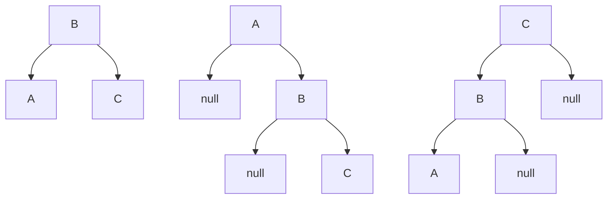
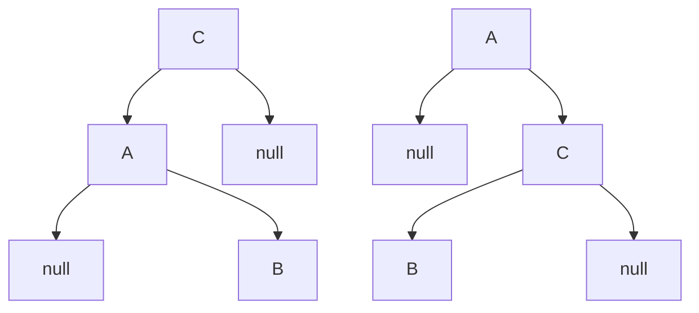
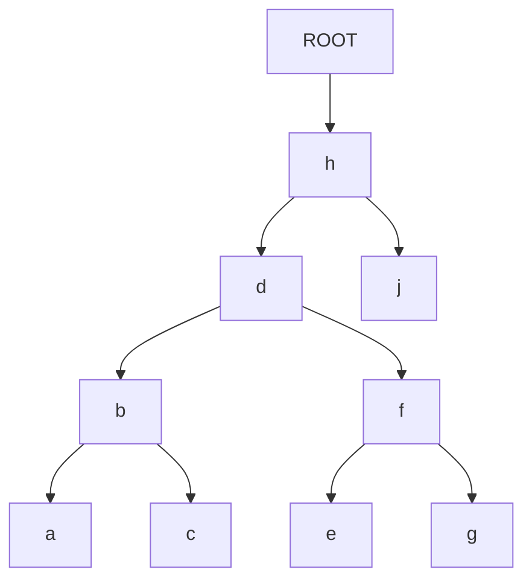
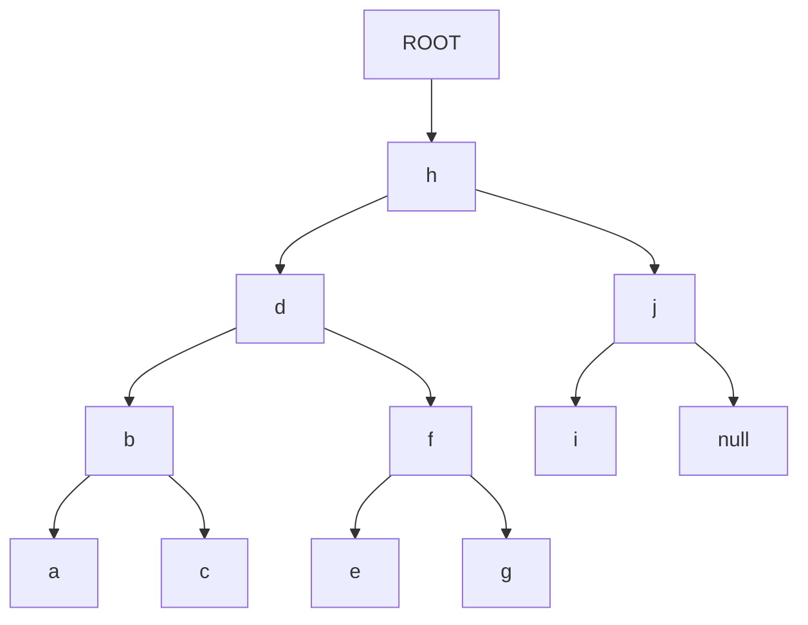
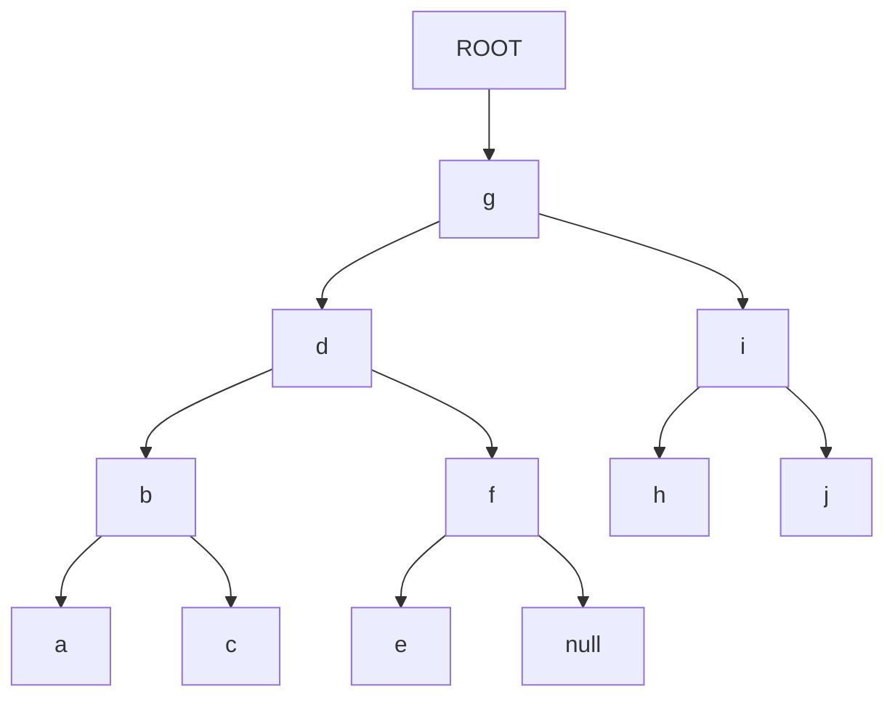
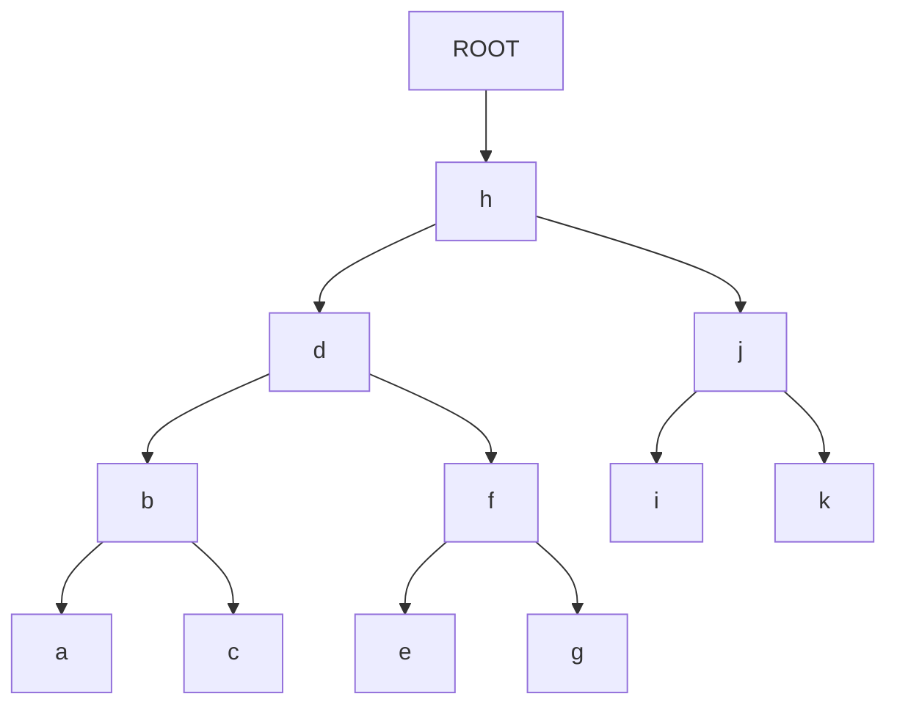

<!--
 Copyright (C) 2022 José Enrique Vilca Campana

 This program is free software: you can redistribute it and/or modify
 it under the terms of the GNU Affero General Public License as
 published by the Free Software Foundation, either version 3 of the
 License, or (at your option) any later version.

 This program is distributed in the hope that it will be useful,
 but WITHOUT ANY WARRANTY; without even the implied warranty of
 MERCHANTABILITY or FITNESS FOR A PARTICULAR PURPOSE.  See the
 GNU Affero General Public License for more details.

 You should have received a copy of the GNU Affero General Public License
 along with this program.  If not, see <http://www.gnu.org/licenses/>.
-->
<!--

-->
# Balancing a binary tree

A < B < C

### + 2 nodes

extra nodes: `h,j`
or

### + 3 nodes

extra nodes: 3 : `h,j,i`

or

# + 4 nodes

extra nodes: 4 : `h,j,i,k` : root & right
note: same tree if we add 4 nodes to the bottom of left

###

<!-- a,b,c,d,e,f,g,h,i,k -->
