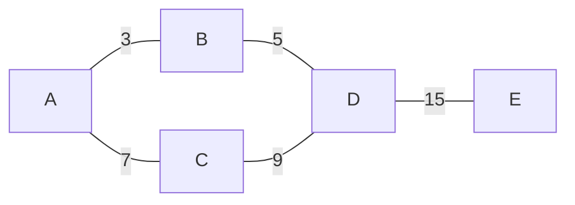
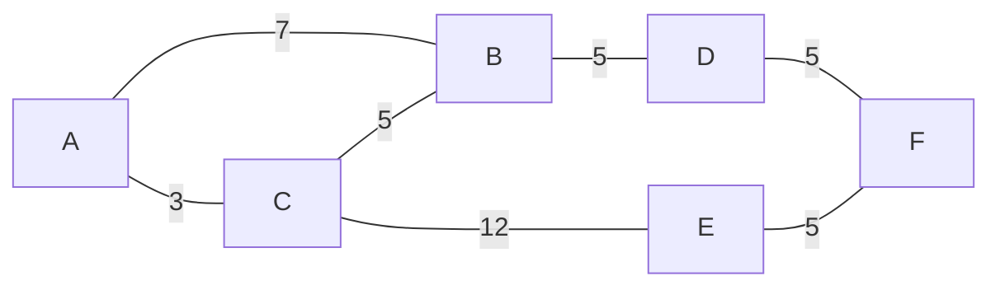
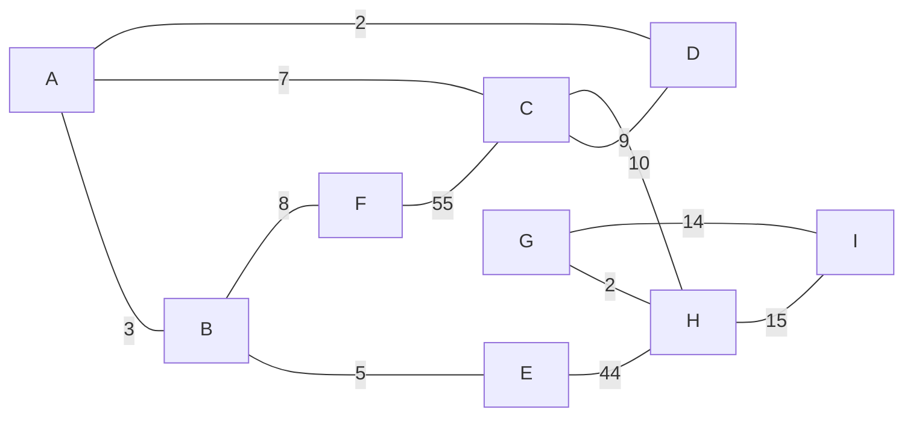
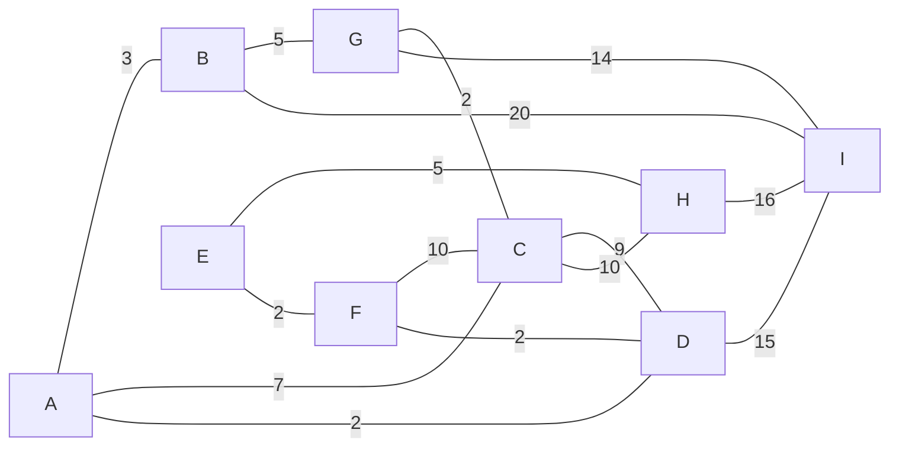

<!--
 Copyright (C) 2022 José Enrique Vilca Campana

 This program is free software: you can redistribute it and/or modify
 it under the terms of the GNU Affero General Public License as
 published by the Free Software Foundation, either version 3 of the
 License, or (at your option) any later version.

 This program is distributed in the hope that it will be useful,
 but WITHOUT ANY WARRANTY; without even the implied warranty of
 MERCHANTABILITY or FITNESS FOR A PARTICULAR PURPOSE.  See the
 GNU Affero General Public License for more details.

 You should have received a copy of the GNU Affero General Public License
 along with this program.  If not, see <http://www.gnu.org/licenses/>.
-->

## Examples A to last letter

### Simple

Best path: A->B->D->E
weights: 3->5->15 = 33

Best path: A->C->B->D->F
weights: 3->5->5->5 = 18

### Medium

Best path: A->C->H->I
weights: 7->10->15 = 32

